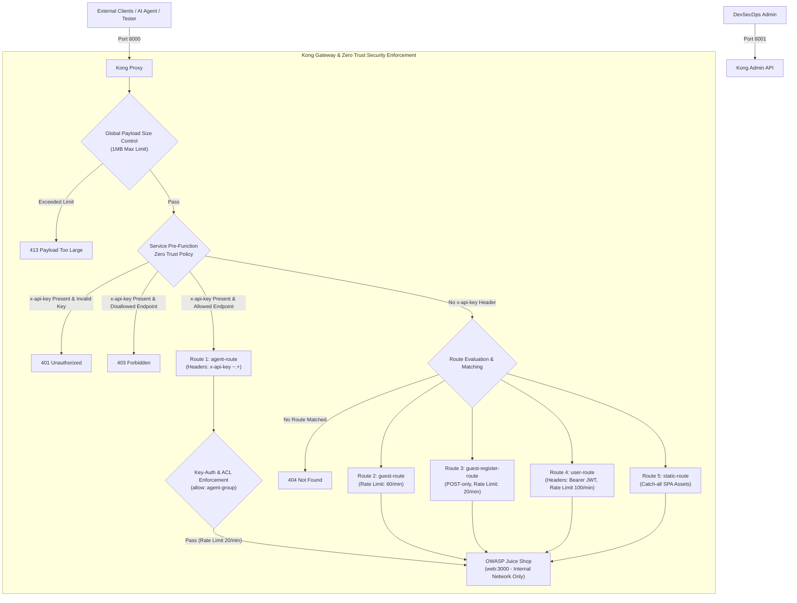
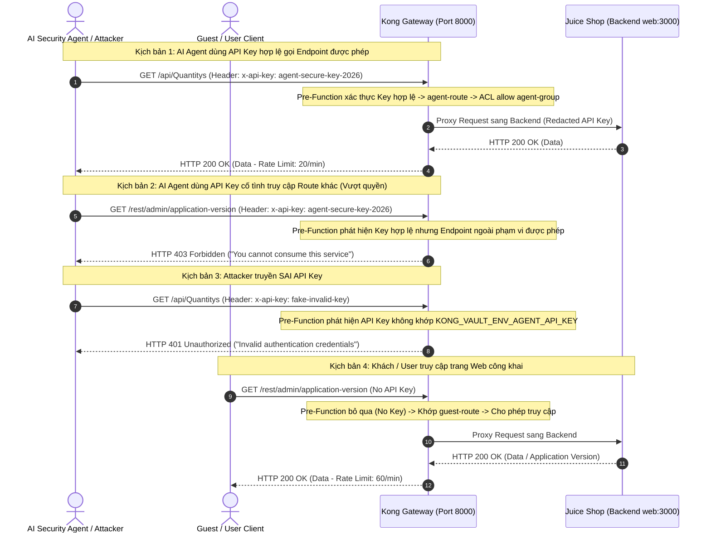

# Báo Cáo Tuần 4 - Kong API Gateway

## 1. Sơ Đồ Kiến Trúc Hạ Tầng Kong API Gateway & Network Isolation

---

## 2. Luồng Hoạt Động Kiến Trúc Decoupled JWT & Zero Trust RBAC

---

## 3. Nội Dung Báo Cáo Tóm Tắt & Quy Trình Triển Khai

### A. Quản Lý Secret & Biến Môi Trường (Không Hardcode Secret)
- Secret `KONG_VAULT_ENV_AGENT_API_KEY` được khai báo độc lập trong tệp `.env` (`agent-secure-key-2026`).
- Khi container `sentinel-kong-gateway` khởi chạy, câu lệnh `command` trong `docker-compose.yml` thực thi thay thế biến môi trường động vào `/tmp/kong.yml` mà không lưu secret thô trong Git repository.

### B. Cơ Chế Chặn Zero Trust (Pre-Function Policy)
- **Kiểm soát API Key**: Nếu request chứa header `x-api-key` hoặc `apikey`, plugin `pre-function` ở cấp Service lập tức kiểm tra tính hợp lệ. Nếu key không khớp secret môi trường, Gateway từ chối ngay với **`401 Unauthorized`**.
- **Phân quyền Endpoint (RBAC)**: Nếu Key hợp lệ, `pre-function` tiếp tục đối chiếu URI request với danh sách endpoint cho phép (`/api/Quantitys`, `/rest/products/search`, `/rest/user/login`). Nếu truy cập endpoint khác, Gateway từ chối ngay với **`403 Forbidden`**.
- **Tính cô lập cho Guest**: Nếu request không có header `x-api-key`, hệ thống phục vụ người dùng khách vãng lai bình thường qua các route tương ứng (**`200 OK`**).
