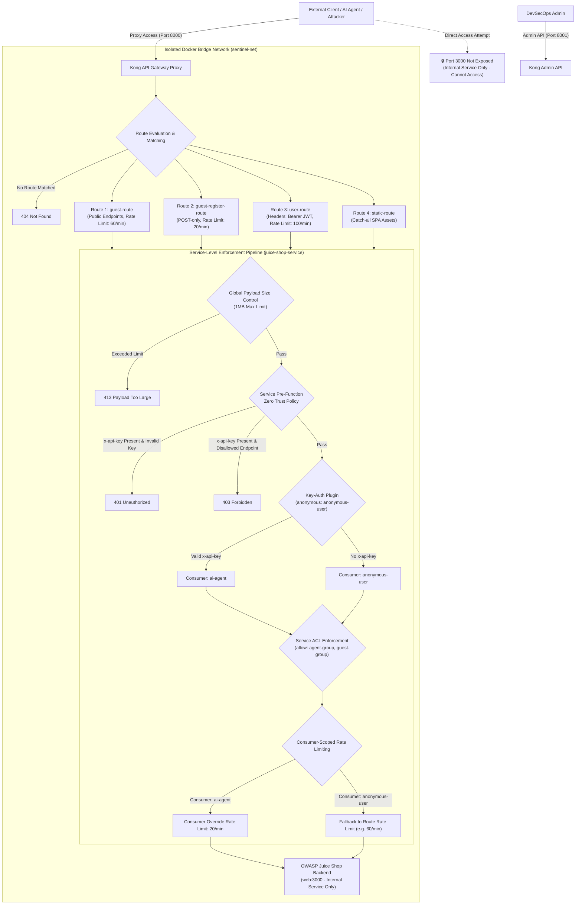
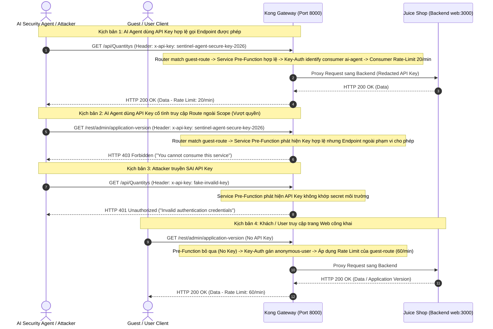

# Báo Cáo Tuần 4 - Kong API Gateway

## 1. Sơ Đồ Kiến Trúc Hạ Tầng Kong API Gateway & Network Isolation



> **Lưu ý về Nguyên tắc Cô lập Mạng (Network Isolation)**:
> - **Cổng 8000 (Kong Proxy)** là điểm đầu vào duy nhất (**Single Entrypoint**) cho mọi lưu lượng từ bên ngoài.
> - **Cổng 3000 (Juice Shop)** là dịch vụ nội bộ (**Internal Service Only**) trong mạng `sentinel-net`. Cổng 3000 **không được expose/publish ra ngoài Host**, giúp ngăn ngừa hoàn toàn việc client truy cập trực tiếp vào backend mà bắt buộc phải đi qua bộ lọc Zero Trust của Kong Gateway.

---

## 2. Luồng Hoạt Động Kiến Trúc Decoupled JWT & Zero Trust RBAC



---

## 3. Nội Dung Báo Cáo Tóm Tắt & Quy Trình Triển Khai

### 3.1 🎯 Ứng Dụng Mẫu & Môi Trường Thử Nghiệm
- **Backend Application**: Sử dụng OWASP Juice Shop (Docker Image: `bkimminich/juice-shop:latest`).
- **Network Isolation Policy**: Chạy trong Docker Bridge Network `sentinel-net`. Cổng 3000 **không được expose ra ngoài Host** (Internal Service Only) nhằm đảm bảo 100% lưu lượng bắt buộc phải đi qua API Gateway.

### 3.2 🛡️ Cấu Hình Hạ Tầng Kong API Gateway (Port 8000 & 8001)
- **Cổng Proxy (Port 8000)**: Điểm đầu vào duy nhất (Single Entrypoint) cho mọi lưu lượng từ bên ngoài.
- **Cổng Admin API (Port 8001)**: Dùng kiểm tra trạng thái và routes của Gateway. *(Khuyến nghị Production: Cần bảo mật bằng SSH Tunnel hoặc chặn public access)*.
- **Quản Lý Secret Bí Mật**: Secret API Key được khai báo qua biến `KONG_VAULT_ENV_AGENT_API_KEY` trong `.env` (`sentinel-agent-secure-key-2026`). Script LuaJIT `render_config.lua` nạp động vào `/tmp/kong.yml` khi boot container mà không lưu secret thô trong Git.
- **Cơ Chế Bảo Vệ Hạ Tầng**:
  - **Giới hạn kích thước Payload**: Sử dụng `allowed_payload_size: 1` (chặn gửi file/payload lớn hơn 1MB).
  - **Giới hạn thời gian chờ (Timeouts)**: `connect_timeout: 5000ms`, `read_timeout: 5000ms`, `write_timeout: 5000ms` giúp bảo vệ Gateway không bị nghẽn kết nối và chống DoS/Slowloris nếu server đích sập.
  - **Giấu API Key với Backend**: Cấu hình `hide_credentials: true` trong plugin `key-auth` để Kong tự động bóc tách header `x-api-key` trước khi proxy tới Juice Shop.

### 3.3 🚦 Phân Luồng Routing, Phân Quyền ACL & Rate Limiting

| Tên Route | Danh sách Paths | Phương Thức (Methods) | Phân Quyền & Nhận Diện | Giới Hạn Tốc Độ (Rate Limit) |
|---|---|---|---|---|
| **`guest-route`** | `/api/Quantitys`, `/rest/products/search`, `/rest/admin/application-version`, `/rest/user/login`, `/rest/user/reset-password` | `GET`, `POST`, `OPTIONS` | Công khai (Guest / User) | 60 requests/phút |
| **`guest-register-route`** | `/api/Users`, `/api/SecurityAnswers` | `POST`, `OPTIONS` | Đăng ký tài khoản (Tách riêng để giới hạn method) | 20 requests/phút (Anti-Spam) |
| **`user-route`** | `/rest/basket`, `/api/BasketItems`, `/rest/user/whoami`, `/profile/image/file`, `/rest/order-history` | `GET`, `POST`, `PUT`, `DELETE`, `OPTIONS` | Đã đăng nhập (Yêu cầu Header `Authorization: Bearer <JWT>`) | 100 requests/phút |
| **`static-route`** | `/` (Catch-all) | `GET`, `POST`, `HEAD`, `OPTIONS` | Nạp giao diện web SPA (HTML/CSS/JS) | Theo Route |

- **Xác thực & Phân nhóm ACL**:
  - AI Agent dùng `key-auth` nhận diện `ai-agent` (`agent-group`), chỉ được truy cập các endpoint được cấp phép trong allowlist.
  - Request không có API Key đi qua `key-auth` với `anonymous: anonymous-user` (`guest-group`). Quyền JWT được backend Juice Shop kiểm tra *(Nhược điểm: Nếu hacker dùng JWT giả thì Gateway vẫn cho qua `user-route` do thiết kế Decoupled JWT)*.

### 3.4 📜 Quản Lý Allowlist Động Cho AI Agent (`config/allowlist.json`)
- Danh sách allowlist được lưu tại `config/allowlist.json` và nạp động tự động vào `pre-function` plugin bằng `render_config.lua` tại boot-time.
- **Endpoints AI Agent được phép**: `/api/Quantitys`, `/rest/products/search`, `/rest/user/login`.

### 3.5 🔧 Sự Cố Kỹ Thuật Đã Xử Lý & Vấn Đề Tồn Đọng

#### A. Sự Cố Đã Xử Lý (Route Shadowing Bug)
- **Vấn đề**: `agent-route` bị shadow bởi `guest-route` làm cho rate limit của Agent bị áp nhầm theo `guest-route` (60 req/min).
- **Nguyên nhân**: Thuật toán tính điểm (Point Scoring) của Kong 3.x Traditional Router ưu tiên route có số lượng path nhiều hơn (5 paths > 3 paths).
- **Giải pháp**: Triển khai `key-auth` ở cấp Service với `anonymous` fallback, xóa `agent-route` trùng lặp và cấu hình Consumer-Scoped Rate Limiting (**20 req/min**) cho `ai-agent`.

#### B. Các Vấn Đề Tồn Đọng & Thảo Luận Kỹ Thuật
1. **Vấn đề Cấu hình Method theo Route**:
   - `methods` áp dụng cho toàn bộ path trong cùng một route. Đã giải quyết cho `POST /api/Users` bằng cách tách riêng thành `guest-register-route`.
2. **Vấn đề Static Route `/` và khả năng truy cập Endpoint chưa liệt kê**:
   - *Câu hỏi*: Vấn đề xảy ra khi sử dụng static route `/` $\rightarrow$ Các endpoint chưa được đề cập trong route có bị truy cập được không? Có nên lập Denylist hay không?
   - *Trả lời*: Trong Kong Router, exact/prefix match có path dài hơn (như `/api/Quantitys`) luôn có độ ưu tiên cao hơn catch-all `/` của `static-route`. Tuy nhiên, do có sử dụng `/` để lấy được các endpoint giao diện từ web nên các endpoint chưa được nhắc tới trong route vẫn có thể truy cập được bình thường qua `/`, chưa thật sự deny endpoint đối với trường hợp của người dùng/tester.
3. **Vấn đề API Key truyền chuỗi rỗng (`""`)**:
   - *Câu hỏi*: Nếu API Key truyền là chuỗi rỗng `""` thì có truy cập được không?
   - *Trả lời*: Mã nguồn Lua trong `pre-function` kiểm tra `if key and key ~= "" then`. Nếu truyền `""`, Gateway sẽ xử lý như một request không có key (đưa về nhóm Guest) thay vì báo 401 Unauthorized.


### 3.6 🛠️ Công Cụ Python Tool Gửi Request An Toàn (`safe_requester.py`)

- **Quản lý Quyền Truy Cập (API Key)**: Tự động đính kèm header `x-api-key` lấy từ môi trường (`AGENT_API_KEY`) để Agent không thể truy cập trái phép vào các route ngoài scope cấp phép.
- **Giới Hạn Thời Gian Chờ (Timeout Protection)**:
  - Thiết lập `timeout = 7` (7 giây) cho tất cả các yêu cầu HTTP.
  - *Lý do*: Kong Gateway được cấu hình `connect_timeout` & `read_timeout` là 5 giây (5000ms). Việc đặt timeout ở Tool là 7 giây tạo ra khoảng đệm 2 giây, giúp Tool hứng trọn vẹn thông báo lỗi `504 Gateway Timeout` từ Kong nếu backend Juice Shop bị treo, thay vì Tool tự ngắt kết nối (`ReadTimeout`) làm sai lệch nguyên nhân thực sự.
- **Giới Hạn Kích Thước Response (Response Size Control)**:
  - Sử dụng tham số `stream=True` trong thư viện `requests` để không nạp toàn bộ response body vào RAM cùng một lúc.
  - Đọc dữ liệu theo luồng `response.iter_content(chunk_size=2048)`, chỉ giữ lại tối đa 2048 bytes (2KB) đầu tiên.
- **Kiểm Soát Phương Thức HTTP (HTTP Method Policy)**:
  - Chỉ cho phép các phương thức `GET`, `POST`, `OPTIONS`. 
  - Nếu truyền phương thức khác (`DELETE`, `PUT`, `PATCH`), Tool sẽ từ chối ngay tại lớp Python và trả về thông báo lỗi HTTP 405 (Method Not Allowed).
- **Hàm Thực Thi Chuẩn**: Định nghĩa hàm `send_request(url, method="GET", headers=None, payload=None)`.
- **Bảo Vệ Dữ Liệu Nhạy Cảm (Redaction)**:
  - Tự động mờ hóa (redact) các trường nhạy cảm: `x-api-key`, `apikey`, `authorization`, `password`, `token`, `secret`, `set-cookie`, `cookie`.
  - Gọi hàm `mask_sensitive_data()` **1 lần duy nhất** trên toàn bộ dữ liệu (headers + body). Kết quả được dùng chung cho cả việc ghi log và trả về cho caller, đảm bảo không rò rỉ dữ liệu nhạy cảm.
- **Xử Lý Payload Ngoại Cỡ (Oversized Payload)**:
  - Khi nhận `payload_category: "oversized_payload"`, Tool tự động sinh chuỗi `"A" * 1_500_000` (~1.5MB) trong RAM cục bộ Python và gửi POST request tới Gateway để thử nghiệm kịch bản `413 Payload Too Large`.

---

### 3.7 🤖 AI Security Agent Kiểm Thử Request & Guardrails

- **Xử Lý Ngôn Ngữ Tự Nhiên**: Nhận yêu cầu kiểm thử từ người dùng dạng văn bản (VD: *"Kiểm tra rate limit của endpoint /api/Quantitys"*, *"Thử XSS trên search endpoint"*).
- **Đề Xuất Payload An Toàn**: Agent đọc `config/payloads.json` để xác định nhóm `payload_category` phù hợp và gợi ý các giá trị `payload_value` an toàn.
- **Xác Nhận Trước Khi Chạy**: Hiển thị đầy đủ kịch bản đề xuất (Endpoint, Method, Payload) cho người dùng xác nhận trước khi thực hiện.
- **Phân Tích Báo Cáo Phản Hồi**: Agent gọi `safe_requester.py`, nhận kết quả đã masked, phân tích status code và đưa ra nhận xét theo **Mindset Guardrails** (xác nhận các mã `413`, `429`, `403` là bằng chứng Gateway hoạt động đúng thiết kế).

---

### 3.8 📜 Quy Trình & Cấu Trúc Nhật Ký (Audit Log)

- **Bộ Lọc Redact Đệ Quy (`mask_sensitive_data`)**:
  - Đối với `dict`: Duyệt từng cặp key/value. Nếu key thuộc danh sách nhạy cảm $\rightarrow$ thay bằng giá trị `[REDACTED_*]`. Nếu value là `dict` hoặc `list` $\rightarrow$ thực hiện gọi đệ quy.
  - Đối với `list`: Duyệt từng phần tử và áp dụng đệ quy cho từng phần tử.
  - Đối với `str`: Sử dụng Regex quét và che các chuỗi dạng JWT (3 phần) và Email.
- **Cấu Trúc Nhật Ký Audit (`logs/gateway_audit.jsonl`)**:
  ```json
  {
    "timestamp": "2026-08-15T10:00:00.000Z",
    "endpoint": "/api/Quantitys",
    "method": "GET",
    "status_code": 200,
    "request_headers": {
      "x-api-key": "[REDACTED_SECRET]"
    },
    "response_headers": {
      "Set-Cookie": "[REDACTED_SECRET]"
    },
    "response_body_snippet": "Tối đa 2048 bytes nội dung (đã được làm sạch)",
    "duration_ms": 45.2
  }
  ```

---

## 4. Các Vấn Đề Tồn Đọng & Định Hướng Phát Triển

1. **Đánh đổi giữa giới hạn kích thước Response và độ chính xác Redaction**:
   - Việc cắt response ở mốc 2KB trước khi mờ hóa (mask) có thể vô tình làm đứt ngang chuỗi bí mật (như JWT hoặc Email) ngay tại ranh giới 2048 bytes, khiến Regex không khớp trọn vẹn. Đây là sự đánh đổi cần thiết để chống tấn công cạn kiệt bộ nhớ (Zip-bomb / DoS).
2. **Cải tiến tham số `oversized_payload`**:
   - Trong các giai đoạn phát triển tiếp theo, khi Agent chỉ đề xuất request, tham số `oversized_payload` có thể chuyển thành dạng tham số boolean trong hàm `send_request` để người dùng dễ dàng tùy chọn sử dụng.