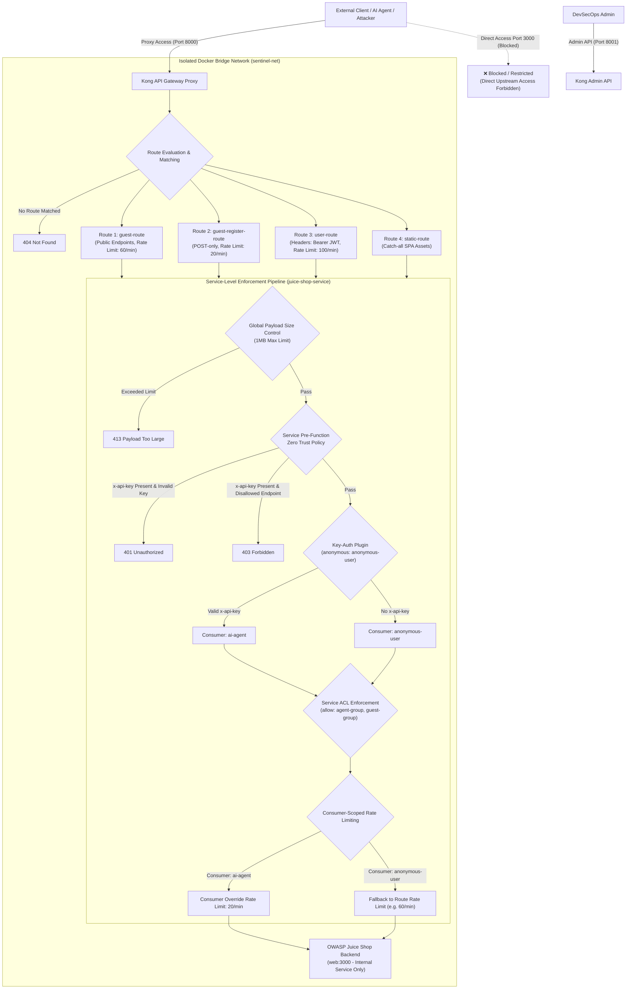

# Báo Cáo Tuần 4 - Kong API Gateway

## 1. Sơ Đồ Kiến Trúc Hạ Tầng Kong API Gateway & Network Isolation

> **Lưu ý về Nguyên tắc Cô lập Mạng (Network Isolation)**:
> - **Cổng 8000 (Kong Proxy)** là điểm đầu vào duy nhất (**Single Entrypoint**) cho mọi lưu lượng từ bên ngoài.
> - **Cổng 3000 (Juice Shop)** nằm trong mạng nội bộ `sentinel-net`. Trong mô hình sản xuất DevSecOps, các yêu cầu truy cập trực tiếp cổng 3000 (không qua Gateway 8000) đều bị chặn để đảm bảo mọi request phải qua bộ lọc Zero Trust.

---

## 2. Luồng Hoạt Động Kiến Trúc Decoupled JWT & Zero Trust RBAC

---

## 3. Nội Dung Báo Cáo Tóm Tắt & Quy Trình Triển Khai

### A. Quản Lý Secret & Biến Môi Trường (Không Hardcode Secret)
- Secret `KONG_VAULT_ENV_AGENT_API_KEY` được khai báo độc lập trong tệp `.env` (`agent-secure-key-2026`).
- Khi container `sentinel-kong-gateway` khởi chạy, câu lệnh `command` trong `docker-compose.yml` thực thi thay thế biến môi trường động vào `/tmp/kong.yml` mà không lưu secret thô trong Git repository.

### B. Cơ Chế Chặn Zero Trust & Consumer-Scoped Rate Limiting (Option B Architecture)
- **Kiểm soát API Key**: Nếu request chứa header `x-api-key` hoặc `apikey`, plugin `pre-function` ở cấp Service lập tức kiểm tra tính hợp lệ. Nếu key không khớp secret môi trường, Gateway từ chối ngay với **`401 Unauthorized`**.
- **Phân quyền Endpoint (RBAC Scope)**: Nếu Key hợp lệ, `pre-function` tiếp tục đối chiếu URI request với danh sách endpoint cho phép (`/api/Quantitys`, `/rest/products/search`, `/rest/user/login`). Nếu truy cập endpoint khác (ví dụ `/rest/admin/application-version`), Gateway từ chối ngay với **`403 Forbidden`**.
- **Xác thực Consumer & Tránh Shadowing Route**: Sử dụng `key-auth` ở cấp Service với cấu hình `anonymous: anonymous-user`. Điều này giúp định danh chính xác Consumer `ai-agent` khi có API key hợp lệ, và tự động chuyển về `anonymous-user` khi không có key mà không gặp lỗi shadowing route trong thuật toán routing traditional của Kong.
- **Giới hạn Tốc độ Dựa trên Consumer Identity**: Áp dụng plugin `rate-limiting` cho consumer `ai-agent` ở mức 20 requests/phút. Người dùng công khai (guest) không truyền API Key sẽ tuân theo rate limit mặc định của từng route (60 requests/phút đối với public endpoints và 20 requests/phút đối với registration anti-spam).
