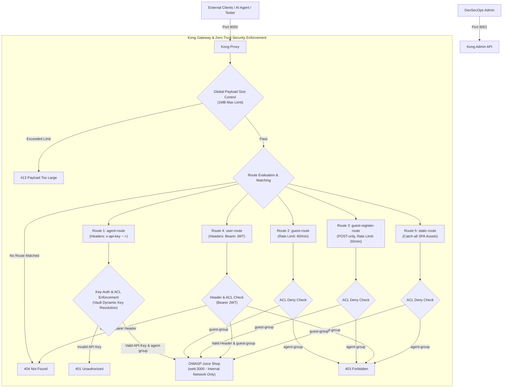
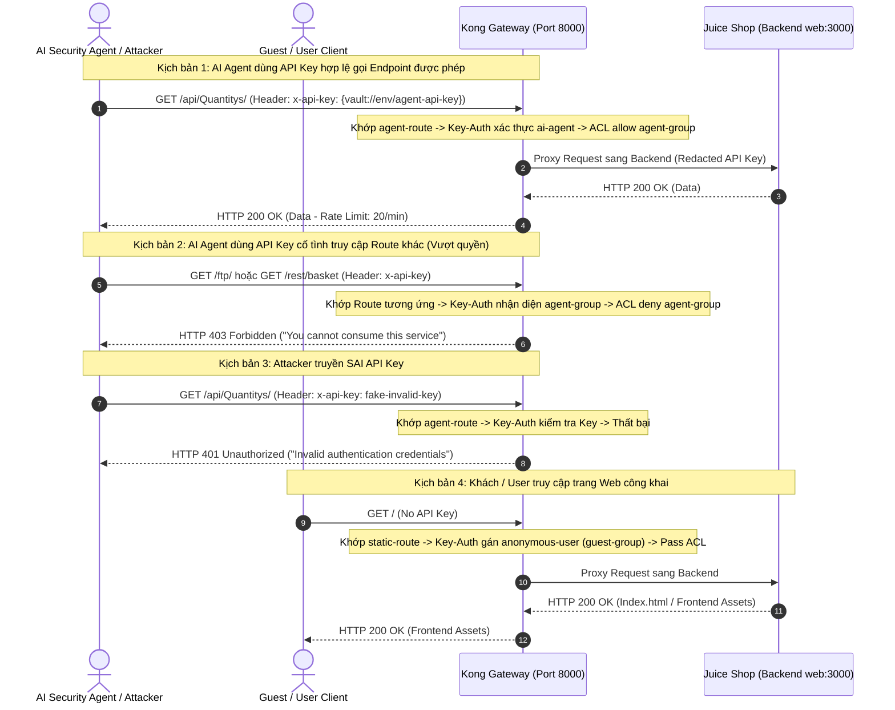

# Báo Cáo Tuần 4 - Kong API Gateway

## Sơ Đồ Kiến Trúc Hạ Tầng Kong API Gateway & Network Isolation

---

## Luồng Hoạt Động Kiến Trúc Decoupled JWT & Zero Trust RBAC

---

## Tóm Tắt Cấu Hình Bảo Mật

1. **Bảo Mật API Key Không Hardcode**:
   - Sử dụng plugin **Kong Vault Environment** (`{vault://env/agent-api-key}`).
   - Đọc trực tiếp secret từ biến môi trường `KONG_VAULT_ENV_AGENT_API_KEY` trong `docker-compose.yml`.

2. **Chặn AI Agent Vượt Quyền (403 Forbidden)**:
   - Các Route công khai (`guest-route`, `guest-register-route`, `user-route`, `static-route`) đều được trang bị plugin `acl` cấu hình `deny: [agent-group]`.
   - Nếu AI Agent mang `x-api-key` truy cập ngoài phạm vi 3 endpoint được phép (`/api/Quantitys`, `/rest/products/search`, `/rest/user/login`), Kong sẽ lập tức trả về **`403 Forbidden`**.

3. **Chặn API Key Giả Mạo / Sai (401 Unauthorized)**:
   - Route `agent-route` áp dụng `key-auth` nghiêm ngặt (không có fallback anonymous).
   - Nếu gửi API Key sai, Kong chặn ngay tại Gateway với **`401 Unauthorized`**.

4. **Phân Tách Rate Limiting Độc Lập**:
   - `agent-route`: 20 requests/phút.
   - `guest-route`: 60 requests/phút.
   - `guest-register-route`: 20 requests/phút (Anti-Spam).
   - `user-route`: 100 requests/phút.
   - `static-route`: Không giới hạn (đảm bảo trải nghiệm nạp mượt mà giao diện SPA).
