# Báo Cáo Tổng Hợp Kỹ Thuật Tuần 5: AI Security Agent, Guardrails & Human-in-the-Loop Governance

**Dự án**: Project Sentinel - DevSecOps & AI Gateway  
**Mục tiêu**: Xây dựng khung bảo mật toàn diện cho AI Security Agent tích hợp với Kong API Gateway (v3.6) và OWASP Juice Shop: Khử khuẩn dữ liệu PII/Secrets, Phòng vệ Prompt Injection 2 chiều song ngữ, Động cơ phê duyệt rủi ro Human-in-the-Loop (HITL), Nâng cấp Web UI Dashboard 4 Tabs và Hệ thống tự động hóa Makefile.

---

## 🗺️ 1. Sơ Đồ Luồng Hoạt Động End-to-End (Master Architecture & Data Flow)

Dưới đây là sơ đồ luồng hoạt động khép kín của hệ thống từ lúc tiếp nhận câu lệnh người dùng cho đến khi xuất báo cáo an ninh và ghi vết Audit Log:

```mermaid
flowchart TD
    %% Khai báo các Node chính
    USER(["👤 Người Dùng / Kỹ Sư An Ninh"]):::client
    PROMPT["1. Nhập Câu Lệnh Kiểm Thử<br/>(CLI hoặc Web UI Tab 1)"]:::client
    
    subgraph S1 ["🛡️ LỚP 1: BẢO VỆ ĐẦU VÀO (Input Guardrail Shield)"]
        INJ_CHECK{"Quét Direct Prompt Injection<br/>(detect_prompt_injection)"}:::shield
        BLOCK_INJ["🛑 CHẶN ĐỨNG NGAY LẬP TỨC<br/>(Risk: CRITICAL - Không gọi Tool)"]:::danger
    end

    subgraph S2 ["🧠 LỚP 2: TRÍ TUỆ NHÂN TẠO & PHÂN TÍCH RỦI RO"]
        AGENT["2. AI Security Agent (Qwen / OpenAI)<br/>Phân tích kịch bản & đề xuất Tool Call"]:::agent
        RISK_ENG{"3. Động Cơ Phân Loại Rủi Ro<br/>(assess_request_risk)"}:::engine
    end

    subgraph S3 ["⚠️ LỚP 3: CHỐT CHẶN PHÊ DUYỆT HUMAN-IN-THE-LOOP (HITL)"]
        HITL_GATE{"Mức Rủi Ro Cần Duyệt?<br/>(POST, Payload 1.5MB, Burst Test)"}:::hitl
        HITL_CARD["4. Hiển Thị Thẻ Cảnh Báo Phê Duyệt<br/>(CLI Prompt hoặc Web UI Card)"]:::hitl
        USER_DECISION{"Người Dùng<br/>Quyết Định?"}:::hitl
        HITL_REJECT["🛑 TỪ CHỐI (REJECT)<br/>• Hủy lệnh ngay, 0 network socket<br/>• Log: REJECTED_BY_USER"]:::danger
        HITL_APPROVE["✅ CHẤP THUẬN (APPROVE)<br/>• Tiếp tục thực thi an toàn<br/>• Log: APPROVED"]:::success
    end

    subgraph S4 ["🌐 LỚP 4: THỰC THI & KIỂM SOÁT HẠ TẦNG GATEWAY"]
        SAFE_REQ["5. Safe Requester Client<br/>(Tiêm x-api-key, Timeout 7s, Gzip safe)"]:::tool
        KONG["6. Kong API Gateway (Port 8000)<br/>• Rate Limiting (429)<br/>• Request Size Limiting 1MB (413)<br/>• Key-Auth & ACL Allowlist (403)"]:::gateway
        JUICE["7. OWASP Juice Shop Backend<br/>(Dịch vụ nội bộ cổng 3000)"]:::backend
    end

    subgraph S5 ["🛡️ LỚP 5: KHỬ KHUẨN & PHÒNG VỆ ĐẦU RA (Output Shield)"]
        RAW_RESP["8. Nhận Phản Hồi Thô (Raw HTTP Response)"]:::tool
        PII_MASK["9. Khử Khuẩn PII & Secret (tools/redactor.py)<br/>• SĐT, CCCD, Thẻ Visa, Password, DB URI"]:::shield
        RESP_INJ{"10. Quét Indirect Prompt Injection<br/>(Song ngữ Anh - Việt)"}:::shield
        DELIMITER["11. Đóng Khung Ranh Giới Ngữ Cảnh<br/>&lt;untrusted_http_response&gt;"]:::shield
    end

    subgraph S6 ["📊 LỚP 6: PHÂN TÍCH ĐỘNG & GHI NHẬT KÝ KIỂM TOÁN"]
        LLM_ASSESS["12. Real LLM Dynamic Security Analysis<br/>(Phân tích an toàn, không bị lừa bởi Injection)"]:::agent
        AUDIT_LOG[("13. Audit Log (logs/gateway_audit.jsonl)<br/>100% Redacted PII + Approval Status")]:::log
        FINAL_REPORT["14. Trả Báo Cáo An Ninh Toàn Diện<br/>(Hiển thị trên Terminal / Web UI)"]:::client
    end

    %% Luồng liên kết
    USER --> PROMPT --> INJ_CHECK
    INJ_CHECK -- "Phát hiện Tấn công" --> BLOCK_INJ --> FINAL_REPORT
    INJ_CHECK -- "Hợp lệ" --> AGENT --> RISK_ENG
    
    RISK_ENG --> HITL_GATE
    HITL_GATE -- "LOW (An toàn)" --> HITL_APPROVE
    HITL_GATE -- "MEDIUM / HIGH" --> HITL_CARD --> USER_DECISION
    
    USER_DECISION -- "n / Reject / Enter" --> HITL_REJECT --> AUDIT_LOG
    HITL_REJECT --> FINAL_REPORT
    
    USER_DECISION -- "y / Approve" --> HITL_APPROVE --> SAFE_REQ
    SAFE_REQ --> KONG --> JUICE
    JUICE --> KONG --> RAW_RESP --> PII_MASK --> RESP_INJ
    
    RESP_INJ --> DELIMITER --> LLM_ASSESS
    LLM_ASSESS --> AUDIT_LOG
    LLM_ASSESS --> FINAL_REPORT --> USER

    %% Styling Classes
    classDef client fill:#e3f2fd,stroke:#1565c0,stroke-width:2px,color:#0d47a1;
    classDef agent fill:#f3e5f5,stroke:#7b1fa2,stroke-width:2px,color:#4a148c;
    classDef shield fill:#e8f5e9,stroke:#2e7d32,stroke-width:2px,color:#1b5e20;
    classDef hitl fill:#fff8e1,stroke:#f57f17,stroke-width:2px,color:#e65100;
    classDef engine fill:#fff3e0,stroke:#e65100,stroke-width:2px,color:#bf360c;
    classDef tool fill:#fce4ec,stroke:#c2185b,stroke-width:2px,color:#880e4f;
    classDef gateway fill:#e0f2f1,stroke:#00695c,stroke-width:2px,color:#004d40;
    classDef backend fill:#eceff1,stroke:#37474f,stroke-width:2px,color:#263238;
    classDef danger fill:#ffebee,stroke:#c62828,stroke-width:2px,color:#b71c1c;
    classDef success fill:#e8f8f5,stroke:#117a65,stroke-width:2px,color:#0e6251;
    classDef log fill:#f5f5f5,stroke:#616161,stroke-width:2px,color:#212121;
```

---

## 📋 2. Tổng Hợp Các Hạng Mục Kỹ Thuật Đã Hoàn Thành (Week 5 Plans)

### 2.1. Plan 6: Khử Khuẩn Dữ Liệu Nâng Cao & PII (`tools/redactor.py`)
- **Khử khuẩn đa mẫu PII**:
  - Số điện thoại Việt Nam & quốc tế ➔ `[REDACTED_PHONE]`
  - Số CMND / CCCD 12 số ➔ `[REDACTED_PII]`
  - Số thẻ tín dụng / Visa / Mastercard 16 số ➔ `[REDACTED_CREDIT_CARD]`
  - Địa chỉ Email ➔ `[REDACTED_EMAIL]`
  - Mật khẩu nội dòng & Connection String Database ➔ `[REDACTED_PASSWORD]`
  - Bearer JWT Tokens & Headers nhạy cảm ➔ `[REDACTED_JWT]`, `[REDACTED_SECRET]`
- **Hàm khử khuẩn ngữ cảnh hội thoại**: `sanitize_llm_messages()` làm sạch 100% dữ liệu trước khi gửi sang LLM Provider.

---

### 2.2. Plan 7: Phòng Vệ Prompt Injection & AI Guardrails (`agent/guardrails.py`)
- **Phòng thủ 2 chiều (Bidirectional Defense)**:
  - **Lớp đầu vào (Direct User Input)**: Ngăn chặn câu lệnh tấn công Jailbreak, DAN mode, hoặc nỗ lực đòi in API Key/System Prompt.
  - **Lớp đầu ra (Indirect HTTP Response)**: Nhận diện chỉ dẫn độc hại ẩn giấu trong phản hồi từ backend (song ngữ Anh - Việt).
- **Phân tách ranh giới an toàn (`sanitize_untrusted_response`)**: Bọc nội dung phản hồi trong thẻ `<untrusted_http_response>` để LLM xử lý dữ liệu thụ động thay vì thực thi lệnh.
- **Quy tắc Bất biến (Inviolable Guardrails)** tích hợp trong `agent/system_prompt.txt`.

---

### 2.3. Plan 8: Cơ Chế Phê Duyệt Thủ Công Human-in-the-Loop (`tools/safe_requester.py`)
- **Động cơ phân loại rủi ro (`assess_request_risk`)**:
  - `LOW`: `GET`/`OPTIONS` allowlist, payload lành tính, `count <= 10` ➔ Tự động thực thi an toàn.
  - `MEDIUM`: `POST`/`PUT`/`DELETE`, payload thăm dò `special_chars`, `10 < count <= 20` ➔ Bắt buộc phê duyệt.
  - `HIGH`: Payload ngoại cỡ `oversized_payload` (~1.5MB), burst test `count > 20` ➔ Bắt buộc phê duyệt cảnh báo tài nguyên.
  - `CRITICAL`: Direct Prompt Injection ➔ Guardrail chặn đứng.
- **Hộp thoại tương tác (`prompt_cli_approval`)**:
  - Khi `Approve`: Gửi request qua Gateway, log `approval_status: "APPROVED"`.
  - Khi `Reject`: **Hủy bỏ ngay lập tức, 0 network socket**, log `approval_status: "REJECTED_BY_USER"`.

---

### 2.4. Plan 9: Nâng Cấp Web UI Dashboard 4 Tabs (`agent/ui.py`)
1. **Tab 1 ("🤖 AI Security Agent")**: Hỗ trợ thẻ phê duyệt HITL trực quan, phân tích an ninh động từ Real LLM (Qwen) và nút Preset Live Injection & PII Probe.
2. **Tab 2 ("⚡ Manual HTTP Tester")**: Kiểm thử HTTP request thủ công có tích hợp chốt chặn đánh giá rủi ro HITL trước khi gửi.
3. **Tab 3 ("📜 Audit Log Inspector")**: Trực quan hóa nhật ký `logs/gateway_audit.jsonl` đã làm sạch 100% PII kèm Badges trạng thái và Approval tag.
4. **Tab 4 ("🛡️ Guardrails & Safety Inspector")**: Công cụ kiểm tra khử khuẩn trực tiếp (Live PII Tester), bảng lịch sử phê duyệt HITL và System Prompt rules.

---

### 2.5. Plan 10: Chuẩn Hóa Test Suite & Tự Động Hóa Makefile
- Xây dựng 4 lệnh Makefile chuẩn hóa:
  - `make test-week5`: Chạy toàn bộ 40 test cases tự động.
  - `make test-redaction`: Thử nghiệm khử khuẩn văn bản nhập từ bàn phím (hoặc `TEXT="..."`).
  - `make test-live-injection`: Chạy kịch bản E2E Live Prompt Injection + PII Probe với Real LLM Model.
  - `make agent-interactive`: Khởi chạy CLI Agent ở chế độ tương tác hỏi phê duyệt trực tiếp trên Terminal.

---

## 🧪 3. Bảng Kết Quả Kiểm Thử Toàn Diện (Master Test Suite)

Toàn bộ **40 unit test cases** đạt **100% PASS** trong thời gian thực thi tối ưu:

| Module Kiểm Thử | Tệp Kiểm Thử | Số Test Cases | Trạng Thái | Thời Gian |
|---|---|:---:|:---:|:---:|
| **Advanced PII Masking** | `tests/test_advanced_redactor.py` | 5 | ✅ PASS | 0.001s |
| **Basic Redaction** | `tests/test_redactor.py` | 4 | ✅ PASS | 0.001s |
| **Prompt Injection Defense** | `tests/test_prompt_injection.py` | 6 | ✅ PASS | 0.002s |
| **Human-in-the-Loop (HITL)** | `tests/test_human_approval.py` | 6 | ✅ PASS | 0.003s |
| **AI Agent Logic & Real LLM**| `tests/test_agent.py` | 6 | ✅ PASS | 0.002s |
| **Safe Requester Core** | `tests/test_safe_requester.py` | 4 | ✅ PASS | 0.005s |
| **Safe Payload Handler** | `tests/test_payload_handler.py` | 5 | ✅ PASS | 0.001s |
| **Audit Logger Engine** | `tests/test_logger.py` | 1 | ✅ PASS | 0.001s |
| **Web UI Dashboard Helpers** | `tests/test_ui.py` | 3 | ✅ PASS | 0.003s |
| **TỔNG CỘNG** | **9 Test Modules** | **40 Test Cases** | **✅ 100% PASS** | **0.020s** |

---

## 🎯 4. Kết Luận & Bàn Giao

Hệ thống **Project Sentinel - Week 5** đã hoàn thành 100% các mục tiêu đề ra theo chuẩn DevSecOps:
1. Đảm bảo an toàn dữ liệu tuyệt đối với bộ lọc PII và che giấu secret.
2. Thiết lập lá chắn phòng vệ vững chắc trước các cuộc tấn công Prompt Injection trực tiếp và gián tiếp.
3. Kiểm soát chặt chẽ các hành động rủi ro cao thông qua cơ chế phê duyệt Human-in-the-Loop.
4. Cung cấp giao diện trực quan và bộ công cụ tự động hóa hoàn chỉnh phục vụ vận hành và giám sát an ninh.
