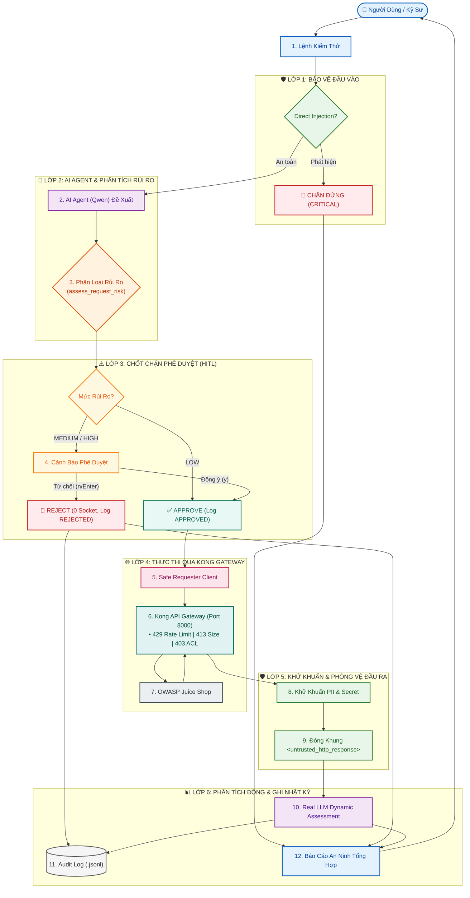

# Báo Cáo Kỹ Thuật Tuần 5: Guardrails, phê duyệt thủ công và che dữ liệu nhạy cảm

## 🗺️ 1. Sơ Đồ Luồng Hoạt Động End-to-End (Data Flow)

---

## 🛡️ 2. Bảng Tổng Hợp 5 Trụ Cột Kỹ Thuật Cốt Lõi (Week 5 Pillars)

| Trụ Cột / Module | Vị Trí Code | Cơ Chế & Tính Năng Trọng Tâm | Kết Quả Đạt Được |
|---|---|---|---|
| **1. Khử Khuẩn PII & Data Redaction** | `tools/redactor.py` | • Che SĐT VN, CCCD 12 số, Thẻ Visa/Mastercard 16 số, Mật khẩu, DB URIs. • `sanitize_llm_messages()` làm sạch ngữ cảnh trước khi gửi LLM. | 100% PII & Secrets được che giấu an toàn dạng `[REDACTED_*]`. |
| **2. Phòng Vệ Prompt Injection 2 Chiều** | `agent/guardrails.py` `agent/system_prompt.txt` | • **Lớp vào**: Chặn câu lệnh người dùng cố ý bẻ khóa (Jailbreak/DAN/Secret exfiltration). • **Lớp ra**: Bọc HTTP Response trong thẻ `<untrusted_http_response>`. | Triệt tiêu nguy cơ chiếm đoạt quyền điều khiển LLM song ngữ Anh - Việt. |
| **3. Phê Duyệt Rủi Ro (HITL Engine)** | `tools/safe_requester.py` `agent/agent.py` | • Phân loại: `LOW` (tự chạy), `MEDIUM`/`HIGH` (bắt buộc duyệt), `CRITICAL` (chặn). • Fail-Closed: Mặc định từ chối (`REJECTED_BY_USER`, 0 network socket). | Ngăn chặn hành động nguy hiểm (POST, Payload 1.5MB, Burst Test). |
| **4. Web UI Dashboard 4 Tabs** | `agent/ui.py` | • Tab 1: AI Agent (HITL Card, Real LLM, Live Probe). • Tab 2: Manual Tester (Đánh giá rủi ro trước gửi). • Tab 3: Audit Logs (.jsonl). • Tab 4: Guardrails & Live PII Inspector. | Giao diện DevSecOps trực quan, realtime, quản trị thuận tiện. |
| **5. Chuẩn Hóa Test & Makefile** | `Makefile` `tests/` | • `make test-week5`: Chạy toàn bộ 40 test cases. • `make test-redaction`: Khử khuẩn văn bản nhập từ bàn phím. • `make test-live-injection`: Kiểm chứng E2E với Real LLM Model. • `make agent-interactive`: Chạy CLI Agent tương tác HITL. | Bộ tự động hóa hoàn chỉnh, dễ dàng tích hợp CI/CD pipeline. |

---

